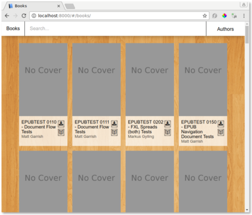
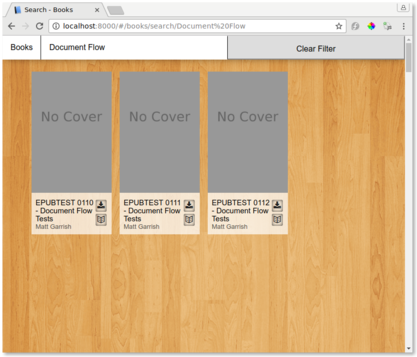
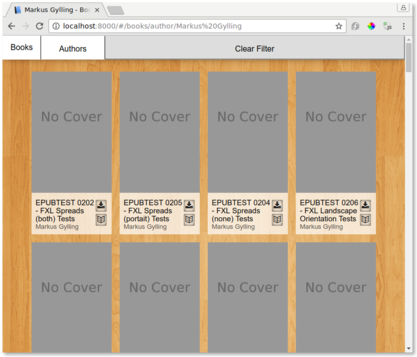
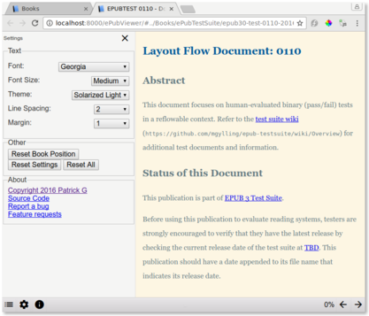

# BookBrowser

A tool to generate a web-based epub book browser.

This works on Linux and Windows with Python 2.7.

The web interface works with basic book browsing support on IE 8+, Edge, Chrome, Safari, Opera, Android Browser, and other browsers made after 2000.
The web interface works with full search, filters, online reader, state storing in url, and animations on IE 10+, Edge, Firefox 28+, Chrome 21+, Safari 9+, Opera 17+, and Android browser 4.4+.

## Usage

First, [download](https://github.com/geek1011/BookBrowser/archive/master.zip) and extract or clone this repository. Then install python 2.7 if you haven't already. Then:

1. Put epub books in the `Content/Books` folder
2. Run `indexer.py` in python2.7
3. Run `createhtml.py` in python2.7
4. Run `server.py` in python2.7. You can also just open `Content/index.html` in a browser, but you will not be able to read books within the browser.
5. Go to [http://localhost:8000](http://localhost:8000)
6. If you add more books, just repeat these steps again

To clear the metadata and cover cache, either run resetindex.sh on Linux, or delete the txt, jpg, jpeg, and png files from the Content/Books folder.

## Screenshots

