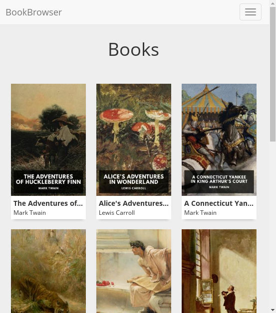
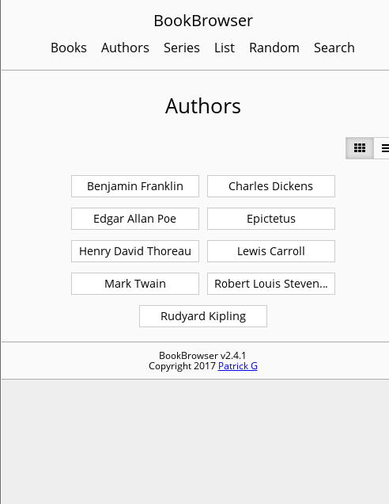
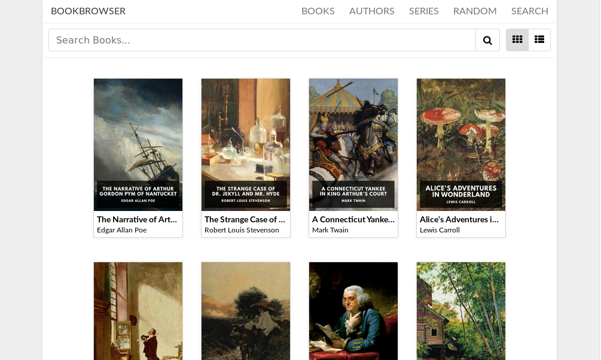
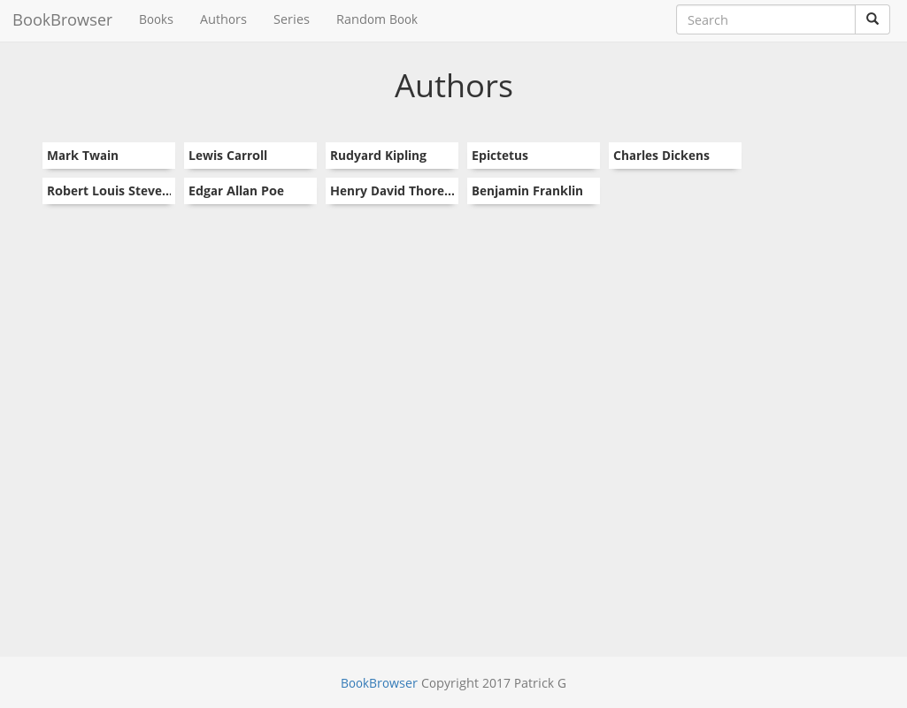
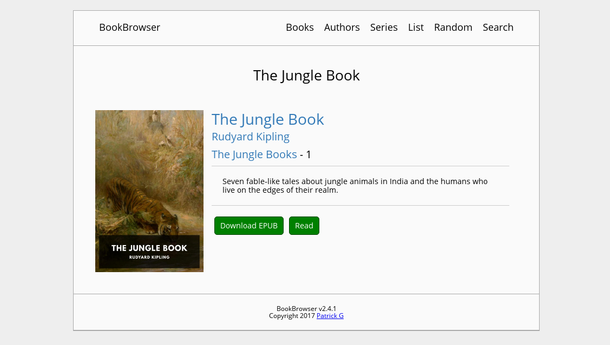

# BookBrowser
[](https://travis-ci.org/geek1011/BookBrowser)

A easy-to-use tool to generate a web-based ePub and PDF ebook browser. All you need to do is [download it](https://github.com/geek1011/BookBrowser/releases/latest) into the folder with your ebooks, and run it. There is also a [demo](https://bookbrowser-demo.geek1011.net/books/).

## Features
- Multiple book formats
    - epub
    - pdf
- Search
- Advanced Search
    - Search any combination of fields
    - View all information in the results
- List view
- Responsive web interface
- Update notifications
- Browse by:
    - Author
    - Series (from calibre metadata)
- Sorted by:
    - Last added
    - Alphabetically
    - Series
- Web based reader
    - Custom fonts, colors, sizing, spacing
    - Remembers your position
    - And more
- Search
- And more
- Easy-to-use
- Fast
- No extra dependencies

## Screenshots

|  |  |  |  |
| --- | --- | --- | --- |
|  |  |  |  |

## Reader Screenshots

| Desktop | Mobile |
| --- | --- |
|  |  |

## Advanced Search

|  |
| --- |
| |

## System Requirements
The server works on all platforms.

The web interface works on IE 9+, Edge, Firefox 3+, Chrome, Safari 5.1+, Opera 17+, and Android browser 4.4+.

The web-based reader works on IE 10+, Edge, Firefox 28+, Chrome 21+, Safari 9+, Opera 17+, and Android browser 4.4+.

## Usage
Run BookBrowser from the directory with the epub books. By default, you can access the web interface at [http://localhost:8090](http://localhost:8090).

You can also use the command line arguments below:

````
  -addr string
    	The address to bind to. (default ":8090")
  -bookdir string
    	The directory to get books from. This directory must exist. (default ".")
  -tempdir string
    	The directory to use for storing temporary files such as book cover thumbnails. This directory is create on start and deleted on exit. (default is a subdirectory in your system's temp directory)
````
